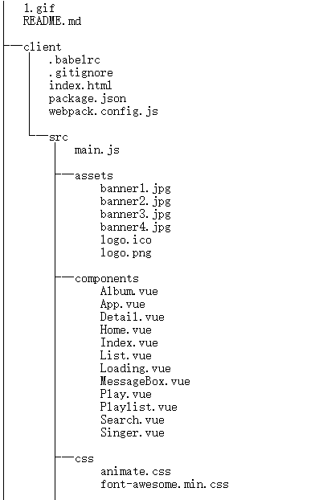
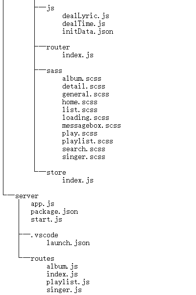

# Cloud-Sing
> 一个前端基于Vue2.0全家桶，后端基于Express/koa(后来用koa重构了后端)的前后端分离的网易云仿写网站。 由于是基于移动端的，前端界面使用了flexbox+rem的布局，兼容了几乎所有移动端尺寸，后端界面使用了musicAPI这个网易云的接口包。 通过这个项目，让我对Vue全家桶更加熟悉，具体可以看一下下面的动态图。

## 功能特点展示

**前端工具**

* Vue2.0
* Vue-Router
* Vuex
* sublime

前端布局采用flexbox+rem布局，关于flexbox请阅读[一个完整的Flexbox指南](http://www.w3cplus.com/css3/a-guide-to-flexbox-new.html)以及这篇最新的[理解Flexbox: 你需要知道的一切](http://www.w3cplus.com/css3/understanding-flexbox-everything-you-need-to-know.html)。

**后端工具**

* koa全家桶
* express
* vscode
* musicAPI

后端我直接使用了musicAPI这个库，是cnode上一个大牛封装好的网易云接口，这是[其他可以参考的网易云接口](http://moonlib.com/606.html)。

## 目录结构

> 
> 

## Step
**环境**

* Node.js V6

**克隆远程库**

git clone https://github.com/mickey0524/Cloud-Sing.git

**安装前后端依赖**

克隆后在client和server(koa_server)目录下执行**npm install**命令

**启动后端服务器**

* 进入到server文件夹下: node start.js
* 或者进入koa_server文件夹下: node start.js

**启动前端项目**

进入到client文件夹下: npm run dev

**生成发布**

npm run build

## License

MIT
